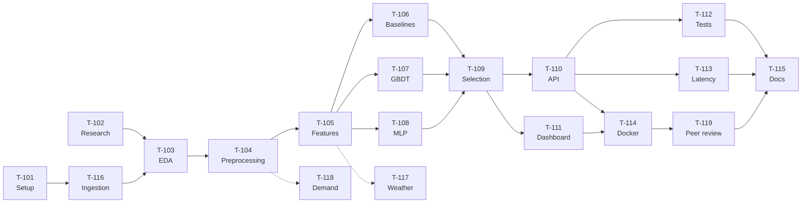

# NYC Taxi Fare and Trip Duration Prediction

Predict the **fare** and **duration** of a New York City yellow taxi ride using only
information available *at the start of the trip*.

---

## Dataset

| Item | Value |
|------|-------|
| Source | NYC TLC Trip Record Data |
| Record type | Yellow Taxi Trip Records |
| Period | **May 2022** (single month, PARQUET) |
| Auxiliary | Taxi Zone Lookup Table (CSV), Taxi Zone Shapefile |

> [!WARNING]
> **The 2022 dataset contains no latitude/longitude columns.** TLC removed raw
> coordinates in mid-2016 and replaced them with `PULocationID` / `DOLocationID`
> (taxi zone IDs, 1–265). Any reference to "pickup and dropoff coordinates" in the
> project brief must be read as *zone IDs*. Coordinates can only be obtained by
> deriving zone centroids from the Taxi Zone Shapefile — which is why the shapefile
> is a **required input**, not a reference document.

### Feature contract (leakage control)

The parquet ships many columns that are only known *after* the ride ends. These are
banned as features across every model ticket.

| Allowed at prediction time | Banned (post-trip / target leakage) |
|---|---|
| `tpep_pickup_datetime` | `tpep_dropoff_datetime` (source of the duration target) |
| `PULocationID`, `DOLocationID` | `fare_amount` (fare target), `total_amount` |
| `passenger_count` | `tip_amount`, `tolls_amount`, `extra`, `mta_tax` |
| `RatecodeID` | `improvement_surcharge`, `congestion_surcharge`, `airport_fee` |
| `trip_distance` ¹ | `payment_type`, `store_and_fwd_flag` |
| `VendorID` | |

¹ `trip_distance` is the *metered* distance of the completed trip. In production you
would only have a routing estimate. Using it is a documented, accepted approximation —
state the assumption in T-105 rather than pretending it is leak-free.

**Targets:** `fare_amount`, and `duration_minutes = tpep_dropoff_datetime − tpep_pickup_datetime`.

---

## Architecture constraints

Two independent Python trees that never import each other. See [CLAUDE.md](CLAUDE.md)
for detail. The three constraints that shape the tickets:

1. **`src/` is not in the Docker build context.** The build context is `./api`, so the
   serialized model artifact is the *only* interface between training and serving.
   Encoders, scalers and feature ordering must be inside the artifact.
2. **The container must be able to unpickle the artifact.** Whichever library wins
   model selection (LightGBM, XGBoost, …) has to appear in `api/requirements.txt`.
3. **`dataset/` and `models/` are gitignored.** Both are populated locally; every
   step that produces them must be reproducible from a script.

---

## Ticket Directory

Tickets are listed in **execution order**. IDs are stable — T-116…T-119 were added
later and deliberately not renumbered.

### Phase 1 — Foundation

| Ticket | Category | Description |
|--------|----------|-------------|
| T-101 | `SETUP` | Repository setup and modular structure |
| T-102 | `RESEARCH` | Literature review summary and schemas |
| T-116 | `DATA` | Reproducible dataset ingestion |

### Phase 2 — Data

| Ticket | Category | Description |
|--------|----------|-------------|
| T-103 | `EDA` | Exploratory data analysis notebook |
| T-104 | `DATA` | Preprocessing and data cleaning module |
| T-105 | `DATA` | Feature engineering pipeline |

### Phase 3 — Modelling (parallel)

| Ticket | Category | Description |
|--------|----------|-------------|
| T-106 | `ML` | Baseline regressors (linear and trees) |
| T-107 | `ML` | Gradient-boosting ensembles (LightGBM and XGBoost) |
| T-108 | `ML` | Multi-layer perceptron (MLP) evaluation |
| T-109 | `EVAL` | Model selection, benchmarking and evaluation |

### Phase 4 — Serving

| Ticket | Category | Description |
|--------|----------|-------------|
| T-110 | `API` | Real-time prediction backend API |
| T-111 | `FRONTEND` | Interactive visual dashboard and demo |
| T-112 | `TEST` | Unit and integration test suite |
| T-113 | `EVAL` | API benchmarking and latency optimisation |
| T-114 | `DEVOPS` | Containerisation and Docker configuration |

### Phase 5 — Delivery

| Ticket | Category | Description |
|--------|----------|-------------|
| T-119 | `REVIEW` | Peer preview and feedback round |
| T-115 | `SETUP` | Final documentation and presentation prep |

### Optional (off the critical path)

| Ticket | Category | Description |
|--------|----------|-------------|
| T-117 | `OPTIONAL` | Weather enrichment via third-party API |
| T-118 | `OPTIONAL` | Taxi demand prediction by region |

---

## Dependency Flow



Edge list (transitively reduced):

```
T-101 → T-116
T-102 → T-103
T-116 → T-103
T-103 → T-104
T-104 → T-105
T-105 → T-106,  T-105 → T-107,  T-105 → T-108     (parallel)
T-106 → T-109,  T-107 → T-109,  T-108 → T-109
T-109 → T-110,  T-109 → T-111
T-110 → T-112,  T-110 → T-113,  T-110 → T-114
T-111 → T-114
T-114 → T-119
T-112 → T-115,  T-113 → T-115,  T-119 → T-115

optional:  T-105 ⇢ T-117    T-104 ⇢ T-118
```

**Changes from the original DAG**

- `T-106 → T-108` and `T-107 → T-108` removed. The MLP does not depend on gradient
  boosting; the three model families run in parallel off T-105.
- `T-112` was orphaned — it appeared in the directory with no edges at all. Now
  `T-110 → T-112 → T-115`.
- `T-116` inserted before T-103. Nothing previously put data on disk.
- `T-115` now depends on T-112 and (via T-119) on T-111. Final docs need passing
  tests and a demo that has been shown to someone.

---

## Tickets and Acceptance Criteria

### T-101 · `SETUP` · Repository setup and modular structure

**Depends on:** —

- [x] `src/` and `api/` trees exist with the module layout described in CLAUDE.md.
- [x] Root `requirements.txt` (training side) and `requirements-dev.txt` (with
      `pytest`) exist. `make test` runs without a separate manual install.
- [x] `.env` is created from `.env.original`; `make build` and `make down` succeed
      on a clean checkout.
- [x] `dataset/` and `models/` exist with `.gitkeep` and are gitignored.
- [x] Random seed constant defined once in `src/config.py` and imported everywhere.

### T-102 · `RESEARCH` · Literature review summary and schemas

**Depends on:** —
**Artifact:** `docs/Literature_Review.md`

- [x] Short written summary (≤2 pages) of the reference papers and articles.
- [x] Documented list of features other authors found predictive, mapped onto the
      columns actually present in the 2022 schema.
- [x] Architecture diagram of the end-to-end system (training → artifact → API → UI).

### T-116 · `DATA` · Reproducible dataset ingestion

**Depends on:** T-101 — **Artifact:** `src/data_utils.py`, `dataset/taxi_zone_centroids.csv`

- [x] Script (`src/data_utils.py`) downloads, into `dataset/`:
      the May 2022 Yellow Taxi parquet, the Taxi Zone Lookup CSV, and the Taxi Zone
      Shapefile.
- [x] Downloads are idempotent — re-running skips files already present.
- [x] File sizes / row counts are logged and asserted so a truncated download fails
      loudly instead of silently.
- [x] Zone centroids are derived from the shapefile and cached as a lookup table
      keyed by `LocationID`.
- [x] Documented in the README: one command, from empty checkout to populated
      `dataset/`.

### T-103 · `EDA` · Exploratory data analysis notebook

**Depends on:** T-102, T-116 — **Artifact:** `notebooks/01_EDA.ipynb`

- [x] Row count, column dtypes, missing values and duplicate rate reported.
- [x] Distributions of both targets (`fare_amount`, duration) with skew quantified;
      explicit recommendation on whether to log-transform.
- [x] Outlier analysis: negative/zero fares, zero-distance trips, durations of 0 or
      >6 h, `passenger_count = 0`, trips whose timestamps fall outside May 2022.
- [x] Top pickup/dropoff zones and the fare/duration profile of airport rate codes
      (`RatecodeID` 2 and 3).
- [x] Temporal profile: fare and duration by hour-of-day and day-of-week — the
      evidence base for the temporal split in T-104.
- [x] Correlation analysis restricted to the allowed-feature list above.

### T-104 · `DATA` · Preprocessing and data cleaning module

**Depends on:** T-103 — **Artifact:** `src/preprocessing.py`, `notebooks/02_preprocessing.ipynb`

- [x] Cleaning rules from T-103 implemented as pure, individually testable functions.
- [x] All banned columns dropped in a single explicit step; a test asserts none of
      them survive into the feature frame.
- [x] **Temporal split**, not random: train on the first ~3 weeks of May 2022, test on
      the last week. Split boundary is a constant in `src/config.py`.
- [x] Rows dropped are counted and logged by rule, so the cleaning cost is visible.
- [x] Processed dataset written to `dataset/` in parquet.

### T-105 · `DATA` · Feature engineering pipeline

**Depends on:** T-104 — **Artifact:** `src/features.py`, `notebooks/03_feature_engineering.ipynb`, `models/feature_pipeline.pkl`

- [x] Temporal features: hour, day-of-week, month-day, weekend flag, rush-hour flag,
      US holiday flag; cyclical encoding for hour and weekday.
- [x] Zone features built from `PULocationID` / `DOLocationID` — **not** from raw
      coordinates. Includes borough and service-zone joins from the lookup table.
- [x] Haversine distance between zone centroids, plus its ratio to `trip_distance`.
- [x] Categorical encoding strategy chosen and justified (265 zones — one-hot is
      likely wrong; target/ordinal encoding fitted on train only).
- [x] The whole pipeline is a single fitted object (`sklearn` `Pipeline` or
      `ColumnTransformer`) that can be serialized — no loose transformation steps.
- [x] Fitted on train split only; a test asserts no statistic is computed on test data.
- [x] The `trip_distance` assumption (¹ above) documented in a module docstring.

### T-106 · `ML` · Baseline regressors (linear and trees)

**Depends on:** T-105 — **Artifact:** `src/train.py`, `notebooks/04_model_experiments.ipynb`, `models/dt_models.pkl`, `models/dummy_models.pkl`

- [x] Trivial baseline established first: predict the training mean for each target.
      Every later model is reported as improvement over this.
- [x] Decision Tree trained for **both** targets (Linear Regression to be added by Keyneth).
- [x] Decision recorded and justified: two single-output models vs. one multi-output
      model. This choice binds T-107, T-108 and the `MODEL_PATH` contract in T-110.
- [x] Metrics reported per target: MAE, RMSE, MAPE, R².
- [x] Training time and single-row inference time recorded.

### T-107 · `ML` · Gradient-boosting ensembles (LightGBM and XGBoost)

**Depends on:** T-105 — **Runs parallel to T-106, T-108**

- [x] LightGBM and XGBoost trained for both targets on the same splits as T-106.
- [x] Hyperparameter search documented (method, search space, budget) and reproducible.
- [x] Feature importance reported; any feature that looks suspiciously dominant is
      re-checked against the leakage contract.
- [x] Same metric set and timing measurements as T-106.
- [x] Exact library versions recorded — they become container dependencies in T-114.

### T-108 · `ML` · Multi-layer perceptron (MLP) evaluation

**Depends on:** T-105 — **Artifact:** `src/mlp.py`, `docs/T-108-mlp-evaluation.md`, `models/mlp/`

- [x] MLP trained for both targets; architecture, optimiser and schedule documented.
- [x] Numeric features scaled inside the serialized pipeline, not ad hoc in the
      notebook.
- [x] Early stopping on a validation slice carved from the *train* split only.
- [x] Training curves plotted; same metric set and timing measurements as T-106.

### T-109 · `EVAL` · Model selection, benchmarking and evaluation

**Depends on:** T-106, T-107, T-108 — **Artifact:** `models/model.pkl`, `notebooks/04_model_experiments.ipynb`, `docs/T-109-model-selection.md`

- [x] Single comparison table: every model × both targets × {MAE, RMSE, MAPE, R²,
      train time, inference time}.
- [x] Winner chosen on a **stated** trade-off between accuracy and inference latency,
      not accuracy alone.
- [x] Error analysis of the winner: residuals by hour, by borough, by trip length,
      and on airport rate codes.
- [x] **The artifact is self-contained.** `models/model.pkl` bundles the fitted
      preprocessing pipeline, the model(s), the exact feature ordering, and a version
      string. It loads and predicts in a fresh interpreter with `src/` absent from
      `sys.path` — this is the acceptance test, because `src/` is not in the container.
- [x] `MODEL_PATH` contract settled: one bundle for both targets, or separate
      `FARE_MODEL_PATH` / `DURATION_MODEL_PATH`. `.env.original` updated to match.
- [x] Runtime dependencies of the winning model written down and handed to T-114.
- [x] Reproduction instructions: exact commands from raw parquet to `model.pkl`.

### T-110 · `API` · Real-time prediction backend API

**Depends on:** T-109 — **Artifact:** `api/main.py`, `api/app/model/`

- [x] `POST /predict` accepts `PULocationID`, `DOLocationID`, `tpep_pickup_datetime`,
      `passenger_count`, `RatecodeID`, `trip_distance` — **zone IDs, not lat/lon** —
      and returns predicted fare and duration.
- [x] Pydantic schemas in `app/model/schema.py` validate ranges: `LocationID` in
      1–265, `passenger_count` ≥ 1, `RatecodeID` in the documented set. Invalid input
      returns 422 with a useful message, never a 500.
- [x] `GET /health` returns 200 and reports whether the model is loaded and its
      version string — T-113 depends on this endpoint existing.
- [x] Model loaded **once at startup**, not per request.
- [x] Imports written for `api/` as top level (`from app.model.router import ...`).
- [x] Interactive docs reachable at `/docs`.

### T-111 · `FRONTEND` · Interactive visual dashboard and demo

**Depends on:** T-109 — **Artifact:** `ui/`

- [x] User picks pickup and dropoff zones plus a date/time and sees both predictions.
- [x] NYC choropleth map rendered from the Taxi Zone Shapefile, showing predictions
      by region.
- [x] Framework chosen (Streamlit / Gradio / static front-end) and recorded — T-114
      has to add a service for it to `docker-compose.yml`.
- [x] Reads predictions from the T-110 API; it does not load the model itself.
- [x] Handles API downtime with a visible error state rather than a stack trace.

### T-112 · `TEST` · Unit and integration test suite

**Depends on:** T-110

- [x] The two test trees are reconciled: `tests/` (offline pipeline) and `api/tests/`
      (serving) both collect from the repo root via `conftest.py` / `sys.path`
      handling. `pytest` from the root runs everything green.
- [x] Unit tests for cleaning rules and feature engineering, including a leakage test
      asserting no banned column reaches the model.
- [x] Integration test hitting `/predict` and `/health` with FastAPI's `TestClient`,
      using a small fixture model artifact rather than the real one.
- [x] Schema validation tests for out-of-range and malformed payloads.
- [x] `pytest` declared in `requirements-dev.txt`; `make test` works from a clean
      environment.

> Validation evidence: `pytest -q` from the repo root completed successfully with
> `47 passed, 5 skipped` in the current environment.

### T-113 · `EVAL` · API benchmarking and latency optimisation

**Depends on:** T-110 — **Artifact:** `scripts/benchmark_api.py`, `docs/T-113-benchmarking.md`, `docs/benchmark_results.json`

- [x] Load test against `/predict` reporting p50 / p95 / p99 latency and throughput.
- [x] Stated latency budget and a measurement showing whether it is met.
- [x] At least one optimisation attempted and measured before/after (batching, warm
      start, lighter model, feature-computation caching).
- [x] Benchmark is a committed, re-runnable script — not a one-off terminal session.

### T-114 · `DEVOPS` · Containerisation and Docker configuration

**Depends on:** T-109, T-110, T-111 — **Artifact:** `docker-compose.yml`, `Dockerfile.train`, `docs/T-114-containerisation.md`

- [x] `api/requirements.txt` **pinned** and containing the runtime library for the
      winning model from T-109. Acceptance test: `make run` on a clean machine loads
      `model.pkl` without `ModuleNotFoundError`.
- [x] Obsolete `version: "3.9"` key removed from `docker-compose.yml` (Compose v2
      warns on it).
- [x] Dashboard service added to `docker-compose.yml` with the API reachable by
      service name.
- [x] `models/` bind mount verified: a model retrained on the host is picked up by a
      container restart with no rebuild.
- [x] Docker healthcheck wired to `GET /health`.
- [x] Documented: `.env` must be copied from `.env.original` before `make run`.

### T-119 · `REVIEW` · Peer preview and feedback round

**Depends on:** T-114

- [ ] The containerised system is demoed to another team from a clean `make run`.
- [ ] Feedback captured as a written list, each item triaged as fix-now / backlog /
      won't-do.
- [ ] Fix-now items closed before T-115 is considered done.

### T-115 · `SETUP` · Final documentation and presentation prep

**Depends on:** T-112, T-113, T-119

- [ ] README covers: setup, dataset acquisition, training reproduction, running the
      API, running the dashboard, running the tests.
- [ ] Results section with the T-109 comparison table and the T-113 latency numbers.
- [ ] Known limitations documented — including the `trip_distance` assumption and the
      single-month training window.
- [ ] Final presentation deck plus a rehearsed demo script.

---

### T-117 · `OPTIONAL` · Weather enrichment via third-party API

**Depends on:** T-105 — *not on the critical path*

- [ ] Historical hourly weather for NYC in May 2022 fetched and cached locally.
- [ ] Joined to trips on the pickup hour; API key read from `.env`, never committed.
- [ ] Models re-trained with weather features and the delta reported against T-109.
      Adopted only if the improvement justifies the added serving dependency — a
      production API would need a live weather call in the request path.

### T-118 · `OPTIONAL` · Taxi demand prediction by region

**Depends on:** T-104 — *not on the critical path*

- [ ] Trips aggregated into pickup counts per zone per time bucket.
- [ ] Time-series model predicting pickups per zone; evaluated with a temporal
      holdout consistent with T-104.
- [ ] Results visualised on the NYC zone map.
- [ ] Kept in a separate module and notebook; it must not alter the fare/duration
      pipeline.

---

## Cross-cutting definition of done

Applies to every ticket:

- Code lives in `src/` or `api/`; notebooks are exploration surfaces, not production
  logic.
- No banned column from the feature contract ever reaches a model.
- Anything fitted on data is fitted on the train split only.
- The random seed comes from `src/config.py`.
- Any step producing `dataset/` or `models/` content is scripted and re-runnable.

---

## Commands

```powershell
Copy-Item .env.original .env   # required before `make run`
make build                     # docker compose build
make run                       # docker compose up
make test                      # pytest
make down                      # docker compose down
```

Single test: `pytest tests/test_integration.py::test_name` or `pytest -k <expr>`.

Python 3.11, pinned by [api/Dockerfile](api/Dockerfile) and the notebook kernels.
