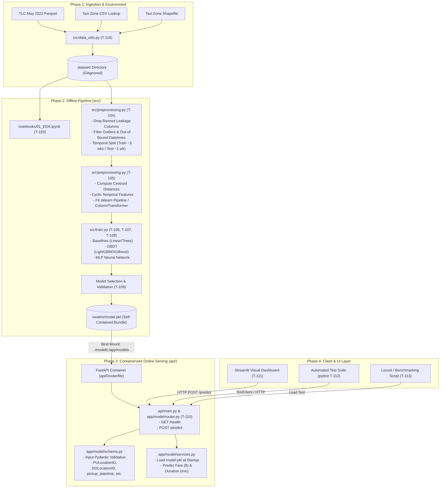

# Literature & Schema Review Summary (T-102)

## 1. Executive Overview & Literature Review

This document synthesizes findings from key domain literature, official NYC Taxi & Limousine Commission (TLC) data specifications, and reference research papers to inform feature engineering, data preprocessing, model selection, and system design for predicting NYC Yellow Taxi fare amounts and trip durations.

---

### 1.1 Stanford CS229 Study: *Fare and Duration Prediction* (Antoniades, Fadavi, Foba Amon Jr., 2016)
- **Problem & Scope**: Analyzed NYC Taxi trip data to predict trip duration and fare amount using only information available at the beginning of a ride.
- **Key Findings & Model Comparison**:
  - Baseline model (predicting mean duration/fare): Fare RMSE = \$10.45 (54.2% error), Duration RMSE = 12.05 min (97.8% error).
  - Linear Regression: Fare RMSE = \$3.52 (21.1% error), Duration RMSE = 6.51 min (38.5% error). Forward selection identified a 20-covariate subset as optimal (adding more covariates did not improve $C_p$ score).
  - Random Forest ($m = \sqrt{n}$, 500 trees): Achieved best performance, Fare RMSE = \$2.28 (14.0% error), Duration RMSE = 5.24 min (24.3% error).
- **Traffic Proxies & Distance Metrics**:
  - The study highlighted that non-linear traffic patterns heavily affect ride duration.
  - Adding `trip_distance^2` improved linear regression by accounting for longer trips experiencing disproportionately higher traffic cumulative delay.
  - Calculated hourly traffic proxies from trip data: `rides_in_hour` (pickup volume per hour) and `avgspd_in_hour` (average trip speed per hour) explained the most variance in duration feature importance.
- **Coordinate Rotation**:
  - Attempted rotating pickup/dropoff coordinates by $36.1^\circ$ to align with Manhattan's street grid system ($x_{\text{rot}} = x \cos \phi - y \sin \phi$). However, the authors noted this rotation yielded **minimal gain** in prediction accuracy over standard tree splits on raw coordinates.

---

### 1.2 Kaggle & TDS Benchmarks: *NYC Taxi Fare Prediction*
- **Feature Engineering Lessons**:
  - **Distance Metrics**: Haversine distance (great-circle) and Manhattan distance (L1 norm along grid) are strong predictors when exact routing distance isn't available upfront.
  - **Directional Features**: Bearing angle ($\theta = \text{atan2}(\sin \Delta \lambda \cdot \cos \phi_2, \dots)$) helps distinguish directional traffic flow (e.g., uptown vs. downtown).
  - **Temporal Deconstructions**: Cyclic encodings ($\sin/\cos$) for hour of day and day of week accurately capture non-linear daily traffic cycles and weekend vs. weekday patterns.
  - **Airport & Fixed-Fare Rates**: Standard flat-rate trips (e.g., JFK Flat Rate = RatecodeID 2) require explicit rate code features or categorical flags to prevent extreme prediction errors.
- **Target Transformations**:
  - Target variables (`fare_amount` and `trip_duration`) are right-skewed with long tails. Log-transformation ($\log(1 + y)$ or $\log(y)$) reduces heteroscedasticity and variance sensitivity during loss optimization (e.g., RMSE on log target evaluates RMSLE).

---

### 1.3 TLC Trip Spec & Schema Evolution (2016–2022)
- **Coordinate to Location ID Transition**:
  - In mid-2016, TLC removed exact latitude/longitude coordinates to protect passenger privacy, replacing them with **265 Taxi Location Zone IDs** (`PULocationID` and `DOLocationID`).
  - **Implication**: Any spatial feature (e.g., Haversine distance, spatial clusters) must be computed using **Zone Centroids** derived from joining the Taxi Zone Shapefile, rather than raw trip coordinates.
- **Rate Code System (`RatecodeID`)**:
  - `1` = Standard rate (metered time + distance)
  - `2` = JFK Flat Rate (\$52.00 in 2016, \$70.00 in 2022+ surcharges)
  - `3` = Newark Airport (special out-of-city rate)
  - `4` = Nassau or Westchester
  - `5` = Negotiated fare
  - `6` = Group ride
  - `99` = Null/Unknown

---

## 2. Feature Mapping Matrix (Literature vs. 2022 Schema)

The table below maps predictive features identified in literature against the actual columns present in the 2022 TLC Yellow Taxi dataset, noting feature availability at prediction time and target leakage constraints.

| Literature Concept | Literature Implementation | 2022 TLC Schema Equivalent | Prediction Time Status | Predictive Value / Engineering Notes |
| :--- | :--- | :--- | :--- | :--- |
| **Pickup Location** | Raw Lat/Lon coordinates | `PULocationID` (1–265) + Zone Centroid Lat/Lon | **Allowed** | Maps to 265 discrete zones. Enriched via Shapefile centroid join and Borough/ServiceZone lookup. |
| **Dropoff Location** | Raw Lat/Lon coordinates | `DOLocationID` (1–265) + Zone Centroid Lat/Lon | **Allowed** | Maps to 265 discrete zones. Key for destination traffic patterns and airport destination flags. |
| **Direct Distance** | Haversine / Manhattan distance on coordinates | Centroid-to-Centroid Haversine & Manhattan Distance | **Allowed** | Derived by calculating distance between `PULocationID` and `DOLocationID` centroids. |
| **Trip Metered Distance** | Taximeter trip distance | `trip_distance` | **Allowed (Approximation)** | Accepted approximation representing estimated routing distance at start of ride. |
| **Time of Pickup** | Datetime parsing (hour, minute, day, month) | `tpep_pickup_datetime` | **Allowed** | Source for hour-of-day, day-of-week, weekend flag, rush-hour flag, and cyclical $\sin/\cos$ features. |
| **Passenger Count** | Passenger integer count | `passenger_count` | **Allowed** | Minor predictor, useful for group rides or vehicle type capacity bounds. |
| **Rate Structure** | Ratecode ID | `RatecodeID` | **Allowed** | Critical flag for non-metered trips (e.g., JFK flat rate, Newark airport, negotiated rates). |
| **Technology Provider** | Vendor ID | `VendorID` | **Allowed** | Provider indicator (CMT, Curb, Myle, Helix). |
| **Dropoff Datetime** | Datetime parsing | `tpep_dropoff_datetime` | ❌ **BANNED (Leakage)** | Post-trip column. Used **only** to calculate the duration target: $\Delta t = t_{\text{dropoff}} - t_{\text{pickup}}$. |
| **Meter Fare** | Base fare charged | `fare_amount` | ❌ **BANNED (Target)** | **Target Variable 1** for fare prediction model. |
| **Total Charge** | Total trip payment | `total_amount` | ❌ **BANNED (Leakage)** | Post-trip column including tips, tolls, and surcharges. Banned as feature. |
| **Tolls & Extras** | Itemized surcharges | `tip_amount`, `tolls_amount`, `extra`, `mta_tax`, `improvement_surcharge`, `congestion_surcharge`, `airport_fee` | ❌ **BANNED (Leakage)** | Known only after trip completion. Banned across all feature sets. |
| **Payment Method** | Cash / Credit card flag | `payment_type` | ❌ **BANNED (Leakage)** | Post-trip transaction information. Banned as feature. |

---

## 3. End-to-End System Architecture Diagram

### Key Architectural Isolation Rule:
The Docker build context is set strictly to `./api`. The offline training code in `src/` is **never available inside the container**. Therefore, the serialized artifact `models/model.pkl` must be fully self-contained, encapsulating:
1. Feature preprocessors (scalers, encoders, spatial centroid lookups).
2. Expected feature column order.
3. Model weights and prediction logic.

---

## 4. References & Data Sources

### Papers & Technical Articles
- [Fare and Duration Prediction: A Study of New York City Taxi Rides](https://cs229.stanford.edu/proj2016/report/AntoniadesFadaviFobaAmonJuniorNewYorkCityCabPricing-report.pdf)
- [Towards Data Science - NYC Taxi Fare Prediction](https://towardsdatascience.com/nyc-taxi-fare-prediction-605159aa9c24)
- [New York Yellow Taxi Demand Prediction Using Machine Learning](https://medium.com/analytics-vidhya/new-york-yellow-taxi-demand-prediction-using-machine-learning-fc697d20ff86)

### TLC Data Dictionaries & MetaData
- [TLC Trip Record User Guide (PDF)](https://www.nyc.gov/assets/tlc/downloads/pdf/trip_record_user_guide.pdf)
- [Yellow Trips Data Dictionary (PDF)](https://www.nyc.gov/assets/tlc/downloads/pdf/data_dictionary_trip_records_yellow.pdf)

### Taxi Zone Maps & Lookup Tables
- [Taxi Zone Lookup Table (CSV)](https://d37ci6vzurychx.cloudfront.net/misc/taxi+_zone_lookup.csv)
- [Taxi Zone Shapefile (ZIP)](https://d37ci6vzurychx.cloudfront.net/misc/taxi_zones.zip)

