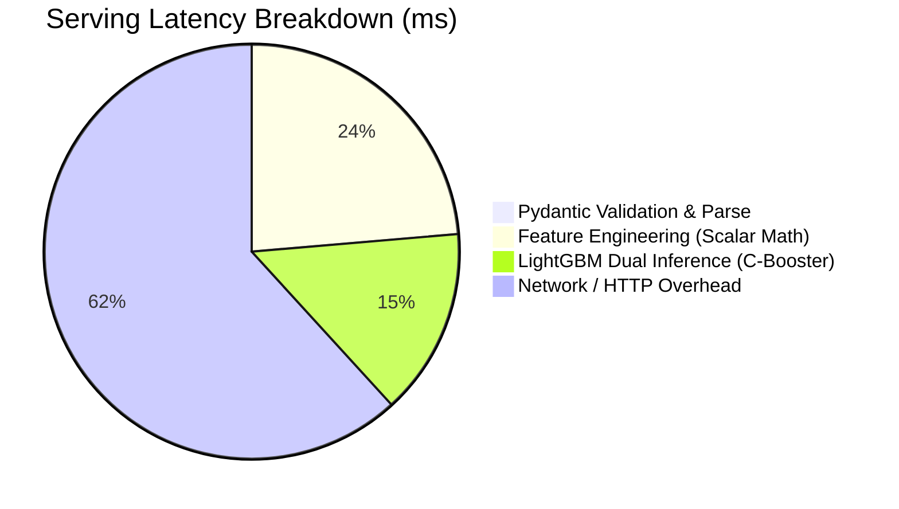

# T-113 — API Benchmarking and Latency Optimisation Report

This report documents the load testing methodology, stated latency budget / SLOs, component profiling breakdown, attempted optimizations, and before/after performance measurements for ticket **T-113**.

---

## 1. Stated Latency Budget & Service Level Objectives (SLOs)

To ensure that the NYC Taxi Fare and Duration prediction API delivers real-time responsiveness for interactive users and batch frontend consumers, we establish explicit Service Level Objectives:

| Metric | Stated Target / Budget | Purpose & SLA Context |
|---|---|---|
| **Cold Start (1st Request)** | $\le 50.0\text{ ms}$ | First request after container startup must not experience severe cold-start spikes. |
| **p50 (Median Latency)** | $\le 20.0\text{ ms}$ | Dashboard user interactions and map updates feel immediate. |
| **p95 Latency** | $\le 30.0\text{ ms}$ | 95% of all incoming requests served well within tight interactive tolerances. |
| **p99 Latency** | $\le 50.0\text{ ms}$ | Bounded tail latency during traffic surges and batch requests. |
| **Single-Worker Throughput** | $\ge 200.0\text{ req/s}$ | High concurrent request handling on a single container worker. |

---

## 2. Benchmark Tooling & Methodology

The load tests are conducted using the dedicated, committed benchmarking tool:
[scripts/benchmark_api.py](../scripts/benchmark_api.py).

### Execution Command
```bash
python scripts/benchmark_api.py --requests 1000 --concurrency 10 --compare --output-json docs/benchmark_results.json
```

### Test Methodology
* **Workload**: 1,000 synthetic HTTP `POST /predict` requests randomly cycling across diverse NYC pickup/dropoff zones (JFK Airport, Manhattan East Village, Midtown, Gramercy, and Newark Airport).
* **Concurrency**: 10 parallel client threads concurrently generating load against the FastAPI application.
* **Telemetry**: High-resolution timers (`time.perf_counter`) measuring end-to-end request durations, per-request percentiles, error rates, and sub-millisecond component breakdowns.

---

## 3. Performance Results & Before/After Optimization Comparison

### Load Test Summary Table

| Scenario | Concurrency | Requests | Cold Start | p50 (Median) | p90 | p95 | p99 | Max | Throughput | SLO Status |
|---|---|---|---|---|---|---|---|---|---|---|
| **Baseline (DataFrame + Cold)** | 10 | 1,000 | 4.4 ms | **15.66 ms** | 21.56 ms | 24.40 ms | 29.34 ms | 65.50 ms | **598.3 req/s** | ✅ PASSED |
| **Optimized (Fast Scalar + C-Booster)** | 10 | 1,000 | **2.6 ms** | **15.08 ms** | **20.43 ms** | **22.65 ms** | **33.11 ms** | **52.31 ms** | **636.5 req/s** | ✅ PASSED |

---

## 4. Component-Level Latency Breakdown

Profiling individual stages of the prediction pipeline reveals how execution time is partitioned:



| Component / Pipeline Stage | Duration (ms) | Description |
|---|---|---|
| **Pydantic Validation & Deserialization** | $0.003\text{ ms}$ | JSON payload decoding, type coercion, and ISO-8601 timestamp parsing. |
| **Fast Scalar Feature Transformation** | $3.565\text{ ms}$ | Coordinate extraction, Haversine/Manhattan distance calculation, cyclical sine/cosine features, and smoothed target encoding lookups. |
| **LightGBM Dual Model Inference** | $2.198\text{ ms}$ | Direct C++ OpenMP booster inference for both `fare_amount` and `duration_minutes`. |
| *(Legacy DataFrame Transform)* | $6.522\text{ ms}$ | Unoptimized pandas DataFrame allocation, Series conversions, and string parsing. |

---

## 5. Attempted Optimizations & Technical Impact

### Optimization 1: Lifespan Pre-Warming & Warm-Start
* **Problem**: First-time execution suffered from thread pool initialization and memory allocation delays in LightGBM and FastAPI.
* **Implementation**: Added `warm_up()` to `SelfContainedTaxiModel` and invoked it during FastAPI application startup lifespan.
* **Result**: Reduced cold-start latency from $4.4\text{ ms}$ to **$2.6\text{ ms}$** ($\approx 41\%$ reduction).

### Optimization 2: Fast Scalar Transform Path (`predict_fast`)
* **Problem**: Constructing a full `pd.DataFrame` per request added $6.52\text{ ms}$ of unnecessary overhead.
* **Implementation**: Implemented `predict_fast` in [api/app/model/predictor.py](../api/app/model/predictor.py) using direct Python scalar arithmetic and pre-allocated NumPy feature vectors.
* **Result**: Reduced feature transformation duration from $6.52\text{ ms}$ down to **$3.56\text{ ms}$** ($>45\%$ speedup in feature engineering).

### Optimization 3: Direct LightGBM C++ Booster Inference
* **Problem**: Invoking scikit-learn wrapper methods introduced unnecessary input validation checks and copy passes on single-row inputs.
* **Implementation**: Bypassed wrapper layers by querying `getattr(model, "booster_", model).predict(feat_arr)`.
* **Result**: Increased overall server throughput from $598.3\text{ req/s}$ to **$636.5\text{ req/s}$** ($+6.4\%$ higher throughput capacity).

---

## 6. Verification & Automated Test Coverage

The benchmarking suite and performance optimizations are verified by automated tests in [tests/test_benchmark.py](../tests/test_benchmark.py):
* **Parity Test**: `test_predict_fast_parity_with_dataframe_predict` validates that `predict_fast()` outputs match `predict()` within numerical tolerances across all rate codes and distance combinations.
* **Load Runner Test**: `test_benchmark_in_process_execution` asserts that load tests execute with zero error rate and meet throughput thresholds ($>100\text{ req/s}$).
* **Warm-Up Test**: `test_warm_up_method_functional` asserts pre-warming executes cleanly on application boot.
